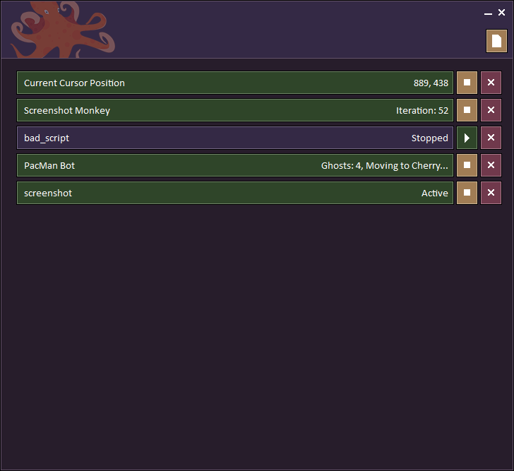

# Akkoro

Akkoro provides automation scripting for sane people. Using scripts written in Lua and a sensible API, you can automate repetitive tasks such as peripheral input, pattern identification, and more.

- Scripts are written in Lua (5.2), and use the `.lua` extension.
- Multiple scripts can be loaded at the same time.
- Each script is executed asynchronously in its own thread.

A full [API Reference](API.md) should be included alongside this document.

## <a name="examples"></a> Examples

### <a name="examples-cursors"></a> Mouse

The simplest thing we can do with the cursor is obtain the current location of it. This can be done using the `GetCursorPosition()` call.

```Lua
Every(500, function()
    local x, y = GetCursorPosition();
    Status(x .. "," .. y);
end);
```

The snippet of code above will display the current position in the script status, refreshed every half-second. As well as getting the cursor position, we can also set the cursor position using the `SetCursorPosition(x, y)` call.

```Lua
    -- Teleport the cursor to +50,+50 of the current location.
    local x, y = GetCursorPosition();
    SetCursorPosition(x + 50, y + 50);
```

As you may notice, calling `SetCursorPosition(x, y)` will teleport the cursor to the new location. While useful, sometimes in automation we want the cursor to move to the destination as if guided by a human, without teleporting.

```Lua
Status("Moving cursor...");
MoveCursor(500, 300, 1, function()
    Status("Finished moving!");
end);
```

The code above makes use of the `MoveCursor(x, y, speed, callback)` function. `x` and `y` define the cursor destination, `speed` controls how fast the cursor will travel (defaults to 1) and the `callback` parameter takes a function that will be invoked when the cursor reaches the destination.

An important thing to note is that the `MoveCursor` function is executed asynchronously and therefore does not block the script thread. If you need to delay until after the cursor movement, utilize the `callback` parameter.

It's possible that after having started the cursor moving with `MoveCursor`, you'd want to stop it before it finishes. To do this, you can simply call `StopMovingCursor()`.

### <a name="examples-keyboard"></a> Keyboard

Before we jump in to emulating keyboard input using scripts, here's a quick example on how we can capture keyboard input...

```Lua
Hook(function(key)
    if key == 27 then
        Stop();
    end
end);
```
The `Hook` function allows us to provide a callback which will recieve all keyboard events. The `key` parameter is the integer value of the key that was pressed, with `27` in the example being the Escape key, as detailed in the [Keys document](KEYS.md).


Fundamentally, keyboard input boils down to two events, **press** and **release**. To emulate these, we can use the `MouseDown` and `MouseUp` calls.

```Lua
KeyDown("Space");
After(1000, function() KeyUp("Space") end);
```

The above example will hold the **space** bar down for one second. There are three important things to note already about using this method:

- We provide literal words for keys, rather than the characters themselves. A full list of these can be found in the [Keys document](KEYS.md).
- Despite "holding" the key for one second, most applications will only register one space character. The repetitive input you expect when holding a key down is done by the microcontroller on your keyboard itself, not the computer.
- Casing of the literals does not effect the output. Both `A` and `a` will produce a lower-case letter `a`. To get upper-case letters using this method, you need to hold the modifiers yourself. See the next example.

```Lua
KeyDown("LShiftKey", "H");
KeyUp("H", "LShiftKey");
```

In the above example, we've demonstrated how to achieve an upper-case letter `H` by first sending the `LShiftKey` event. You'll also notice in the example we've sent `LShiftKey` and `H` into the same call. Both `KeyDown()` and `KeyUp()` accept a variable about of parameters.

Being able to send key **press** and **release** events is useful to have, but it's not very sane. If you want to type out any kind of string of input, you're going to have to do a lot of work! Let's remedy that.

```Lua
TypeKeys("H E L L O Space W O R L D");
-- Output: hello world
```

With the `TypeKeys()` function, we can provide a string of characters to be pressed without needing to worry about sending relevant **press** and **release** calls for each one. Each character, still defined using the literal name listed in the [Keys document](KEYS.md), is separated by either a space or a comma.

Given that each character is pressed/released individually, you'd be forgiven for thinking that some tasks such as typing in upper-case suddenly became impossible using this function. Thankfully, there are two operators that can be used...

```Lua
TypeKeys("^LShiftKey H E L L O Space W O R L D !LShiftKey");
-- Output: HELLO WORLD
```

In this example, you'll notice a `^` and a `!` used before the `LShiftKey` literals.

- Using `^` infront of a literal indicates that the key should be pressed, but not released.
- Using `!` infront of a literal indicates that the key should be released.

At this stage, we're better off than we were with the `KeyDown` / `KeyUp` events, but what if we just wanted to type a quick string of text without wanting having to input each character? This is where `TypeString` comes in!

```Lua
TypeString("Hello world");
-- Output: Hello world
```

As the example above demonstrates, the `TypeString` function takes a string of input and does all of the dirty work for you. Not only does it map the keys and handle the **press**/**release** events, but it also automatically handles the character casing, too.

For a more in-depth look at the keyboard API functions and what can be done, check out the [Keyboard API](API.md#api-keyboard) section.

### <a name="examples-timers"></a> Timers

Timers can be created in a few different ways. The simplest method is to call `After`, providing a delay (in milliseconds) and a callback function.

```Lua
After(5000, function()
    Status("Five seconds have passed!");
end);
```

The above will execute the provided function after five seconds have passed. Another common use-case is to have a timer repeatedly invoke the given function. We can achieve this using the `Every` function.

```Lua
local count = 1;
Every(1000, function()
    Status("Count: " .. count);
    count = count + 1;
end);
```

With that example, the function will be called every one second, incrementing the counter. While useful, the only way to stop this timer is to terminate the script. For this reason, all timer-creation functions return a reference we can use to manipulate the created timer.

```Lua
local count = 1;
myTimer = Every(1000, function()
    if count == 10 then
        myTimer:Stop();
    end

    Status("Count: " .. count);
    count = count + 1;
end);
```

Similar to the example before it, a timer is created that invokes the given function every one second. The difference here is that once the counter reaches ten, the timer is manually stopped.

It's not unlikely that we might want to create a timer that doesn't start straight away. To do this we can make use of the `Timer` function.

```Lua
local timer = Timer(2000, function()
    Status("Two seconds have passed!");
end);

timer:Start(); -- Start the timer, executing just once.
```

As mentioned in the snippet above, once the timer is started it will only execute once. To achieve the repetitive behavior of the `Every` function, we simply call `StartRepeating` instead of `Start`.

For more detailed information on the timer functions, see the API sections on [timers](API.md#api-timers) and [timer references](API.md#timer-ref).



### Region Capture / Image Detection

In this section, we're going to cover a powerful utility provided by Akkoro which allows us to capture specific parts of the screen, as well as locate things. Let's start simple...


```Lua
local screen = GetPrimaryScreen();
local capture = screen:Capture();
capture:Save("capture-screen.png");
```

In the above example, we get a reference to the primary screen, more information on that reference can be found in the [Screens API](API.md#api-screens) section. From that reference, we call `Capture()`, which returns another reference, this one acting as a screenshot, more information of which can be found in the [Image API](API.md#api-image) section. Rather than doing anything fancy with it, we simply call `Save()` to store the screenshot as a file.

```Lua
local screen = GetPrimaryScreen();
local capture = screen:Capture();
local icon = LoadImage("find-me.png");

local success, x, y = capture:Locate(icon);
if success then
    Status("Located: " .. x .. ", " .. y);
else
    Status("Unable to locate!");
end
```

Here we get a little more advanced. The first thing you'll notice is we have another variable called `icon` which is the result of a call to `LoadImage`. As you might be able to guess, `LoadImage` loads an image file, creating the same kind of reference that `Capture()` returns. Rather than saving the screen capture, we instead call `Locate()`, providing the icon image. This will scan over the capture in search of the icon and if found, provide the relative `X` and `Y` position that it was located at.

Two things to note:

- The `X` and `Y` values returned from `Locate()` are relative to the image searched, not the screen.
- Searching large images, such as screen captures, can be slow. If you intend to repeatedly scan, it's better to reduce the region you search in as much as possible.

```Lua
local screen = GetPrimaryScreen();
local capture = screen:Capture();

local icon = LoadImage("some-icon.png");
local success, x, y = capture:Locate(icon);

if success then
    -- We found the icon, every five seconds, check the icon...
    Every(5000, function()
        local region = screen:Capture(x, y, icon:GetWidth(), icon:GetHeight());
        local success, x, y = region:Locate(icon);
        if not success then
            Status("The icon has changed!");
            Stop(); -- Kill the script.
        end
    end);
else
    Status("Unable to locate icon!");
end
```

This example takes into account both of the points mentioned above. Firstly, it locates the icon on the screen. Once we find it, rather than scanning the entire screen again, we simply scan the place where we originally found it, checking that it remains the same each time.

Rather than trying to figure out where a specific window is on the screen based on identifying parts of it, we can make this easier by making use of the [Process API](API.md#api-process) to locate a window.

```Lua
local calcList = ProcessByName("calc");
if #calcList then
    local first = calcList[1];
    local _, _, width, height = first:GetPosition();

    local capture = first:Capture(width / 2, height / 2, width / 2, height / 2);
    capture:Save("half-a-calc.png");
else
    Status("No calculator running! :()")
end
```

In that example, we grab the running process of the Windows Calculator and, using the dimensions obtained through `GetPosition()`, we create a capture of the bottom-right region of the window, saving the result to a file!

For more information on the API used in these examples, check out both the [Screens API](API.md#api-screens) and the [Image API](API.md#api-image).
